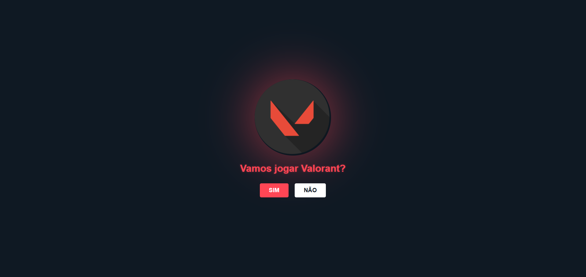

# Botão Tóxico do Valorant



## Sobre o Projeto

Este é um projeto interativo e bem-humorado inspirado no jogo Valorant. A página web apresenta uma pergunta simples: "Vamos jogar Valorant?" com dois botões de resposta: "SIM" e "NÃO".

O projeto está disponível em: [gabecmelo.github.io/valorant-toxic-button](https://gabecmelo.github.io/valorant-toxic-button)

## Funcionalidades

- **Botão "SIM" Impossível**: Quando o usuário tenta clicar no botão "SIM", ele se move aleatoriamente pela tela, tornando impossível clicar nele.
- **Botão "NÃO" com Mensagem**: Ao clicar no botão "NÃO", uma mensagem bem-humorada aparece, agradecendo ao usuário por não jogar Valorant.
- **Design Responsivo**: A página se adapta a diferentes tamanhos de tela, funcionando bem em dispositivos móveis e desktops.
- **Animações Suaves**: As transições do botão "SIM" são suaves e fluidas, criando uma experiência visual agradável.

## Tecnologias Utilizadas

- **HTML5**: Estrutura básica da página
- **CSS3**: Estilização e animações
- **JavaScript Puro**: Lógica de interatividade sem uso de frameworks

## Como Funciona

1. Ao carregar a página, o usuário vê o logo do Valorant e a pergunta "Vamos jogar Valorant?"
2. Dois botões são apresentados centralizados: "SIM" (vermelho) e "NÃO" (branco)
3. Quando o cursor passa sobre o botão "SIM", ele se move para uma posição aleatória na tela
4. Se o usuário clicar no botão "NÃO", um alerta é exibido com uma mensagem bem-humorada

## Como Usar ou Contribuir

1. Clone o repositório:
    ```bash
   git clone https://github.com/gabecmelo/valorant-toxic-button.git
2. Navegue até o repositório clonado:
    ```bash
    cd valorant-toxic-button
2. Abra o arquivo `index.html` em seu navegador para testar localmente

3. Para contribuir, faça um fork do projeto, crie uma branch para sua feature, e envie um pull request

## Autor

Desenvolvido por [Gabriel Melo](https://github.com/gabecmelo)

## Licença

Este projeto é distribuído sob a licença MIT. Veja o arquivo `LICENSE` para mais detalhes.

---

*Este projeto foi criado apenas para fins de entretenimento e não possui afiliação oficial com a Riot Games ou Valorant.*